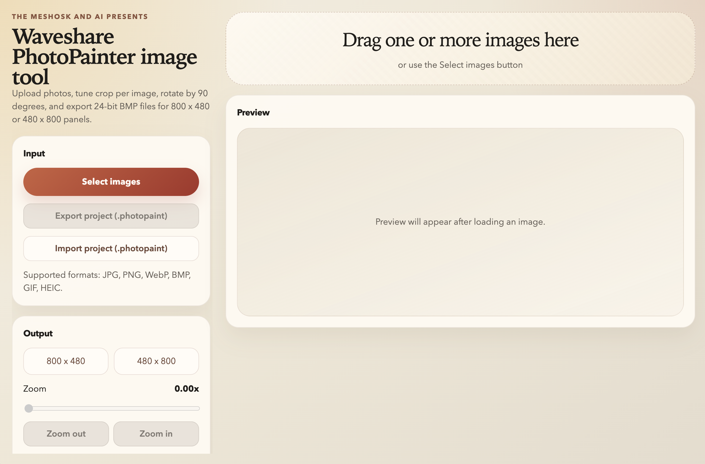

# Disclaimer

Whole app is coded by AI... yeah, I know... I want to try it... 

# PhotoPainter Converter
So you need to convert images for your brand neue [WaveShare PhotoPainter](https://www.waveshare.com/wiki/PhotoPainter) or you have somewhere  E Ink Spectra 6 (E6) Full color and you are in __need__ for __THE CONVERTER__?

Do not search any further! You have just found it!

This app does it all:

- Imports one or more source images at once
- Supported formats: JPG, JPEG, PNG, WebP, BMP, GIF, HEIC, and HEIF
- Supports drag and drop directly into the "working gallery"
- Detects duplicate source images by content hash and skips them
- Lets you switch each image between `800 x 480` landscape and `480 x 800` portrait
- Provides crop, zoom, and 90 degree rotation per image
- Optionally constrains the crop frame so it always stays inside the source image
- Shows a live preview of the final dithered output
- Reduces the image to the 7-color PhotoPainter palette with Floyd-Steinberg dithering
- Exports 24-bit BMP files in needed color format for the E-INK
- Saves and reloads full working sessions as `.photopaint` project files, so you cand add up images in future

## The UI

So the UI looks like this:



There are two main parts:

- THE LEFT panel - contains some setting, it can be scrolled down!
- THE RIGHT panel - show working gallery and crop per image

Some operation tips:

- You drop images you want to add to edit set onto "Drag one or more imaes here" or you selectem using button "Select images". Importing images can take a while (it depends on format).
- Import and Export of wokring images set is done using "Export project (.photopaint)" and "Import project (.photopaint)" buttons
- To export images in the format for eink use button "Export all". If is not visible just scroll left panel down. There is chechbox to set random number prefix, so images are shuffled for eink.
- Settings of crop and orientation are set per image

# What to do if it works?
Nothing you are welcome! ... Adding a star would make me very happy.

# Found something wrong?
Well... you can try to open issue of pull request.


# Development SIDE

This repository supports browser preview without installing Node.js on the host.

Install dependencies in the container:

```bash
docker compose run --rm node npm install
```

Run the preview server:

```bash
docker compose up preview
```

Then open:

```text
http://localhost:4173
```

You can also run the same preview flow directly:

```bash
docker compose run --rm node npm run vite -- --host 0.0.0.0 --port 4173
```

Stop the preview service with:

```bash
docker compose down
```

## Desktop Packaging

The desktop app uses Electron and Electron Builder.

Available packaging commands:

```bash
npm run build:mac
npm run build:win
```

- `npm run build:mac` builds an unsigned macOS app bundle directory
- `npm run build:win` builds a portable Windows `x64` (`amd64`) `.exe`, not an installer
- local `npm run build:win` forces a Windows `x64` portable build and leaves only one `.exe` in `release/`

These commands require a matching host environment with Node.js installed.

### Windows Packaging With Docker

If you do not want Node.js on the host, the repository includes a Docker path for Windows packaging:

```bash
docker compose run --rm build-win
```

Notes:

- this uses the large `electronuserland/builder:wine` image
- on Apple Silicon, the service is pinned to `linux/amd64`
- Windows packaging needs Wine-backed resource tooling when stamping the executable icon

### macOS Packaging

macOS packaging should be done on a real macOS host or macOS CI runner.

A generic Linux Docker container is not a valid replacement for a proper macOS Electron build.

## GitHub Actions Release Flow

The repository includes a release workflow in [.github/workflows/build-desktop.yml](.github/workflows/build-desktop.yml).

It can:

- run manually with `windows`, `macos`, or `all`
- build a macOS ZIP containing the `.app`
- build a Windows portable `.exe`
- publish both assets to a GitHub Release when a tag matching `v*` is pushed

This is the recommended Windows build path if you are on Apple Silicon and do not want to pull the large local Wine image.
